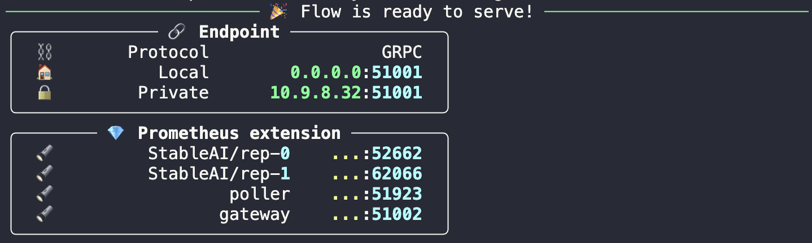

<div align="center">

# Live Novel
---

**Self-host application can generate illustration from a novel by highlighting certain sentences**


</div>

---

Introducing a new app that is ~now available~ (WIP) on [novel.nhtlongcs.com](https://novel.nhtlongcs.com/). This app can generate images from a novel by highlighting certain sentences. The app is easy to use; all you have to do is enter the name of the book and the highlighted sentences will be displayed as images. This can be a great way for authors to promote their work, or for readers to get imagination of what the scene is about without having to do it themselves. 
*At the moment, the app is only available with default book for proof of concept.*

## Main features 
[*] **Live novel** is a backend that leverages Stable Diffusion to allow one to create fantasy and beautiful images from novel with customized text prompts.

👼 Available to all: smooth install for self-hosting, Google Colab free tier, and free for public use

🏭 Ready for integration & production: built on top of DocArray data structure, achieve high performance and high quality images from novel text. Live-novel backend is now a high-performance low-latency service supports gRPC/HTTP/websockets and TLS. See [Jina](https://jina.org) for more details.

## Getting started
<!-- how to using app -->
TODO: add instruction

## Installation 
**For self-hosting purposes, you can install Live Novel yourself.**

There are two parts of installation, one is for the backend and the other is for the frontend. This repository is only intended for the backend. To install self-host frontend, please refer to [my co-worker instruction](https://github.com/violeine/live-novel)

The easiest way to install Live Novel is to use [Docker](https://www.docker.com/) 

```bash

### Via conda environment
Currently, the app is only work after installing components via conda environment.

```bash
git clone https://github.com/nhtlongcs/live-novel
cd live-novel
# Download checkpoints
chmod +x download.sh
./download.sh
# Install dependencies
cd stable_diffusion 
pip install -e .
cd src/clip 
pip install -e .
cd ../taming-transformers 
pip install -e .
```

### Via Docker

TODO: add instruction

<details>
<summary>This part does not working yet </summary>
By prebuilt docker image, you can run the app without any specific configuration.
```bash
$ docker pull nhtlongcs/live-novel
```

To install **Live-Novel** and customize locally
<!-- ssh -N -f -p 12156 -L 0.0.0.0:8080:0.0.0.0:8080 root@ssh4.vast.ai -->
```bash
$ cd <this-repo>
$ DOCKER_BUILDKIT=1 docker build -t live-novel:latest .
```
</details>

## Serving your backend

Serving the app following command:
```bash
python -m jina flow --uses flow.yml
```
The expected output should be like this:


TODO: add instruction


### Via Google Colab
We also provide a Google Colab notebook for you to try out to serve the app using free gpu resource without waiting behind other pending requests on our server. You can find the notebook [here](https://colab.research.google.com/github/)

TODO: add instruction


### Via Kubernetes

The official serving method is via Kubernetes. Thanks to [Selab](https://www.fit.hcmus.edu.vn/vn/Default.aspx?tabid=292&id=9510) for providing gpu resources for this project.

TODO: add instruction

### Via Docker

```bash
$ docker run --rm --name live-novel --gpus device=0 -p 5001:5001 -it live-novel:latest /bin/bash
$ cd ~/workspace 
$ python app.py --port XXXXX 
```

Use environment variable `CUDA_VISIBLE_DEVICES=-1` to disable cuda.

For debug mode, server will respone a random image. To enable debug mode, use flag `--debug` when running `app.py`

For customize purpose, please clone this repo and use flag `-v $(pwd)/:/home/dreamer/workspace/src/` to replace source code in the docker
TODO: add instruction


### Misuse, Malicious Use, and Out-of-Scope Use
_Note: This section is taken from the [DALLE-MINI model card](https://huggingface.co/dalle-mini/dalle-mini), but applies in the same way to Stable Diffusion v1_.

The model should not be used to intentionally create or disseminate images that create hostile or alienating environments for people. This includes generating images that people would foreseeably find disturbing, distressing, or offensive; or content that propagates historical or current stereotypes.

<details>
<summary>More details</summary>

#### Out-of-Scope Use
The model was not trained to be factual or true representations of people or events, and therefore using the model to generate such content is out-of-scope for the abilities of this model.

#### Misuse and Malicious Use
Using the model to generate content that is cruel to individuals is a misuse of this model. This includes, but is not limited to:

- Generating demeaning, dehumanizing, or otherwise harmful representations of people or their environments, cultures, religions, etc.
- Intentionally promoting or propagating discriminatory content or harmful stereotypes.
- Impersonating individuals without their consent.
- Sexual content without consent of the people who might see it.
- Mis- and disinformation
- Representations of egregious violence and gore
- Sharing of copyrighted or licensed material in violation of its terms of use.
- Sharing content that is an alteration of copyrighted or licensed material in violation of its terms of use.

</details>

## Comments 

- My codebase for the application builds heavily on [Jina's DiscoArt](https://github.com/jina-ai/discoart). And use [Stable Diffusion Model](https://github.com/CompVis/stable-diffusion) as the core generation model.
Thanks for open-sourcing!

## Citation
```
@misc{rombach2021highresolution,
      title={High-Resolution Image Synthesis with Latent Diffusion Models}, 
      author={Robin Rombach and Andreas Blattmann and Dominik Lorenz and Patrick Esser and Björn Ommer},
      year={2021},
      eprint={2112.10752},
      archivePrefix={arXiv},
      primaryClass={cs.CV}
}

@InProceedings{Rombach_2022_CVPR,
    author    = {Rombach, Robin and Blattmann, Andreas and Lorenz, Dominik and Esser, Patrick and Ommer, Bj\"orn},
    title     = {High-Resolution Image Synthesis With Latent Diffusion Models},
    booktitle = {Proceedings of the IEEE/CVF Conference on Computer Vision and Pattern Recognition (CVPR)},
    month     = {June},
    year      = {2022},
    pages     = {10684-10695}
}
```
